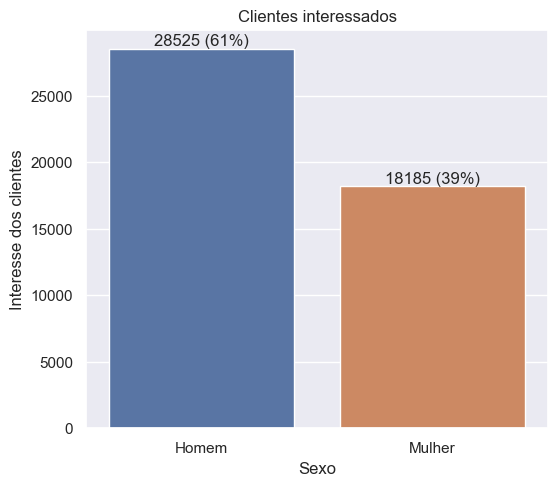
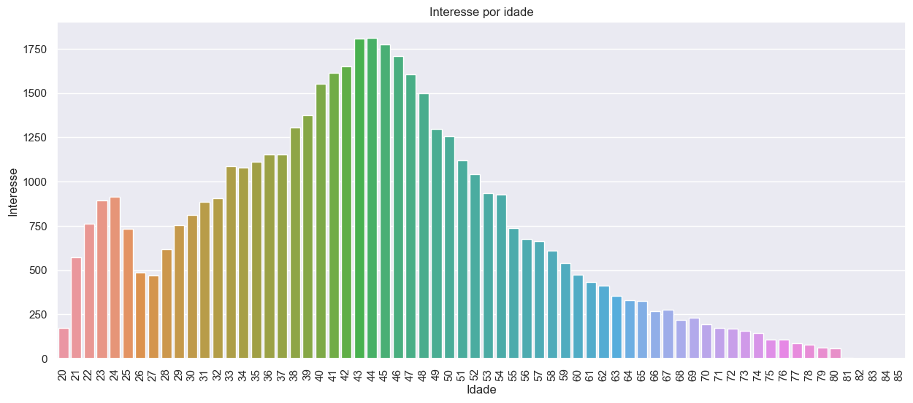
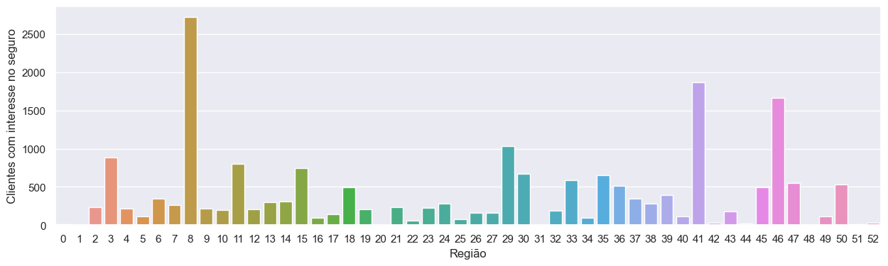
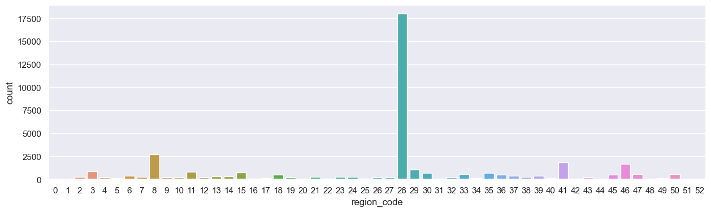
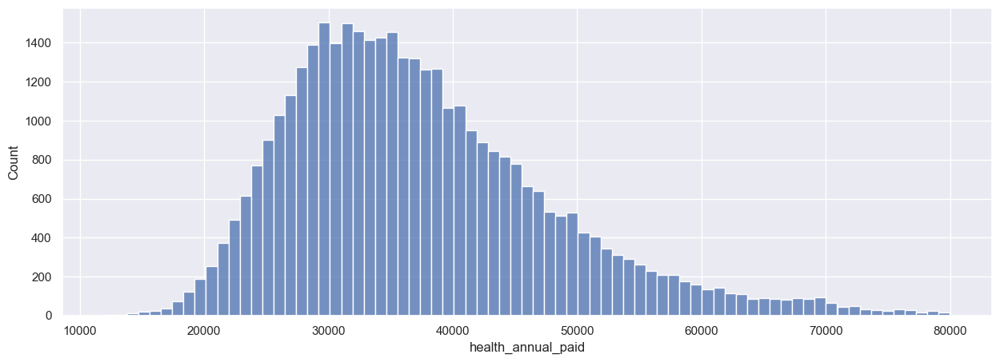

 <h1 align="center">Healt Insurance Ranking </h1>

 
 

 *A logo criada é fictícia.* 

 Este é um projeto com dados de uma empresa fictícia. Aqui eu segui as recomendações da [Comunidade DS](https://comunidadeds.com/) no curso de *Projeto do aluno 004*.

 # Descrição
 A *Health insurance* é uma seguradora que fornece seguro de saúde aos seus clientes, e agora busca vender um seguro de veículo. Um pesquisa então foi realizada com os clientes, que compraram o seguro saúde no ano passado, perguntando a cada um se teria interesse em adquirir o novo seguro. A seguradoda obteve retorno de 304 mil clientes sobre o interesse em adquirir um seguro veicular. O novo seguro foi desenvolvido, e está sendo ofertado aos interessados.

 # 1. Problema do negócio 
Existem mais 76 mil clientes, entre novos e antigos, que não responderam a pesquisa. Entretanto, o *call center*, tem a capacidade de conter apenas alguns clientes. Assim a seguradora deve escolher uma forma de selecionar para quais clientes deve ligar. A equipe de vendas pode fazer um total de 20.000 chamadas, mas pode aumentar para 40.000. Levando em conta o problema apresentado, o cientista de dados (usando *machine learning*) deve fornecer uma lista ordenada desses novos clientes com base em em sua pontuação de propensão de comprar o novo seguro.

# 2. Descrição dos dados
Os dados para este projeto podem ser encontrados [na plataforma Kagle](https://www.kaggle.com/datasets/anmolkumar/health-insurance-cross-sell-prediction). Abaixo seguem as definições para cada um dos atributos (feature):

| **Feature**          | **Definição** |
|----------------------|----------------|
| id                   | ID único do cliente|
| gender               |Sexo do cliente|
| age                  |Idade do cliente|
| region_code          |   Código único da região de cada cliente|
| policy_sales_channel |Código anônimo para o canal de divulgação para o cliente, ou seja. Different Agents, Over Mail, Over Phone, In Person, etc|
| driving_license      |0 : cliente não possui, 1 : cliente possui|
| vehicle_age          |idade do veículo|
| vehicle_damage       |Yes : O cliente teve seu veículo danificado no passado. No: O cliente não teve seu veículo danificado no passado.|
| previously_insured   |1 : Cliente já possui Seguro Automóvel, 0 : Cliente não possui Seguro Automóvel|
| annual_premium       |The amount customer needs to pay as premium in the year|
| vintage              |Número de dias em que o cliente está associado à empresa|
| response             |1 : O cliente está interessado no novo seguro, 0 : O cliente não está interessado no novo seguro|

# 3. Premissas do Negócio
Neste projeto foi necessário classificar os clientes em uma lista, desde o mais provável até o menos provável.

# 4. Planejamento da solução

 A solução do problema se dará com base no ciclo CRISP, em alguns passos que foram adaptados a metodologia. Aplicamos um modelo de Machine Learning de classificação:

- <b> Coletando dados </b>: coleta de dados de um banco de dados PostgreSQL ou na plataforma do Kaggle.
- <b> Limpeza dos dados </b>: Verificação de tipos de dados e Nan's, renomear colunas, lidar com outliers.
- <b> Feature Engineering </b>: Criar novos recursos a partir dos originais, para que possam ser usados no modelo de ML.
- <b> Feature Engineering </b>: Criar novos recursos a partir dos originais, para que possam ser usados no modelo de ML.
-  <b> Exploratory Data Analysis (EDA) </b>: Em tal etapa, os dados foram explorado para obter experiência de negócios, buscar insights úteis e encontrar recursos importantes para o modelo de ML. 
- <b> Preparação de Dados </b>: Aplicação de Técnicas de Normalização e Reescalonamento nos dados; métodos de Encondagem e Transformação de Variáveis ​​de Resposta.
- <b> Seleção de features </b>: Selecionando os melhores features para serem usadas ​​no modelo de ML.
- <b> Machine Learning Modeling </b>: 
    - Rodar algoritmos: KNN classifier, Logistic regression, ExtraTrees classifier, e XGBboost classifier.
    - Plotar curva de ganho cumulativo e lift, e calcular precison@k/recall@k de cada modelo.
- <b> Hyperparameter Fine Tunning </b>: 
    - Fazer um ajuste fino de hiperparâmetros em cada modelo, identificando o melhor conjunto de parâmetros para maximizar suas capacidades de aprendizagem.
    -  Aplicar validação cruzada em cada modelo, reduzindo o viés de seleção (teoria da amostragem), por utilizar várias amostras diferentes dos dados.
    - Calcular precison@k/recall@k dos 4 modelos, e selecionar o de melhor performance.
    - Submeter esse modelo aos dados de teste, e plotar suas curvas de ganho cumulativo e lift.
- <b> Convert Model Performance to Business Values </b>: 
    - Responder as questões de negócio.
    - Traduzir a performance do modelo em resultados financeiros para a seguradora.

## 4.1. Ferramentas e técnicas usadas:
- Python 3.10.8, 
- Pandas, Matplotlib, Seaborn e Sklearn
- SQL e PostgreSQL
- VSCode
- Git e Github
- Análise Exploratória de Dados (EDA)
- Técnicas de Seleção de Recursos
- Algoritmos de Classificação (Classificador KNN, Regressão Logística; Classificadores Random Forest, Extra Trees e XGBoost)
- Métodos de validação cruzada, e métricas de desempenho de aprendizado para classificação (precisão em K, recuperação em K, cumulative gain curve, 2 lift curve)

# Insights e análise das hipóteses (H) de negócio
### **H1.** As mulheres são mais propensas a comprar seguro de carro.
**FALSA**.

  

### **H2.** Clientes mais velhos são mais propensos a contratar um seguro.
**FALSA**.

  

### **H3.** O local onde o cliente vive influencia a decisão de contratar um seguro de automóvel.
**VERDADEIRA**.

  

### **H4.** Clientes que possuem algum dano em seus veículos, possuem maior probabilidade de contratar um seguro de carro.
**VERDADEIRA**.

  

### **H5.** Os clientes que possuem despesas altas com plano de saúde têm maior probabilidade de comprar um novo produto.
**FALSA**.

  

# 5. Machine Learning Models

 A etapa de machine learning onde a modelagem de ML é realizada. Cinco modelos foram treinados usando validação cruzada:

* K-nearest neighbors
* Logistic regression
* Extra Trees classifier
* Xgboost classifier
* Randon forest

|         **Model**        | **Precision at K** | **Recall at K** |
|:------------------------:|:------------------:|:---------------:|
|    KNN Classifier        | 0.265 +/- 0.001  |0.872 +/- 0.003 |
|    Logistic regression   | 0.274 +/- 0.002	|0.903 +/- 0.005|
|   Extra Trees classifier     | 0.275 +/- 0.0  |0.904 +/- 0.001|
|    Xgboost classifier   | 0.284 +/- 0.001  |0.935 +/- 0.004|
|    Randon Forest   | 0.277 +/- 0.001  |0.911 +/- 0.003|

- K é igual a 20.000 ou 40.000, dado nosso problema de negócios. 

- <b> O modelo escolhido neste projeto foi o XGBoost </b>: pois o algoritmo mais rápido para treinar e ajustar, embora seja aquele com melhores resultados sem nenhum ajuste.

- <b> Precision at K </b>: Mostra a fração de previsões corretas feitas até K de todas as previsões.

- <b> Recall at K </b>: Mostra a fração de previsões corretas feitas até K de todos os exemplos verdadeiros.

- Duas curvas podem ser plotadas e oservadas:
    * Cumulative Gains Curve: indica a porcentagem de clientes, ordenada por pontuação de probabilidade, contendo a porcentagem de todos os clientes interessados no novo seguro de veículo.
    * Lift Curve: que indica quantas vezes o modelo ML é melhor que o modelo baseline.

# 6. Resultados do negócio
Dentre os 76.622 cliente, um total de 9.342 estão interessados no seguro de veículos. O ticket médio para um seguro de saúde anual da Health Insurance é de $ 31669. As perguntas abaixo foram respondidas seguindo a premissa de que  os clientes interessados no seguro veicular irão assinar o contrato, e que o valor médio do seguro do veículos será o mesmo do seguro saúde.

<b>1) Qual a porcentagem de clientes interessados em seguro veicular, o call center conseguirá contatar fazendo 20 mil ligações?</b>
*  R: 20.000 chamadas representam 26,24% do nosso banco de dados. Portanto, se a equipe de vendas fizesse todas essas ligações, a seguradora conseguiria entrar em contato com 71,29% dos clientes interessados no seguro de veículos novos. O valor de 0,7129 é o nosso recall em 20.000.

<b>2) Se a capacidade do call center aumentar para 40 mil ligações, qual a porcentagem de clientes interessados em adquirir um seguro veicular o call center conseguirá contatar?</b>
*   R: 40.000 chamadas representam 52,48% do nosso banco de dados. Nesse caso, se a equipe de vendas fizesse todas essas ligações, a seguradora conseguiria entrar em contato com 99,48% dos clientes interessados no seguro de veículos novos. O valor de 0,9948 é o nosso recall em 40.000.

# 7. Conclusões
- Com base nos resultados comerciais, a seguradora passa a ter uma vantagem competitiva sobre seus concorrentes, reduzindo o custo de aquisição de clientes e aumentando sua receita.
- A equipe de vendas pode focar sua atenção nos primeiros 20.000 ou 40.000 clientes da lista e, no futuro, focar nos primeiros K clientes da nova lista.
- Insights foram revelados e com os resultados obtidos é possível simular perfis de clientes, funcionalidade de grande valia para a empresa.

# 8. Próximos passos
- Realizar uma análise de componentes principais (PCA) nos conjuntos de dados.
- Testar o Boruta
- Usar outros algoritmos de classificação
- Fazer o deploy do modelo

---
# Contato
 

[e-mail](karinnasantos0@gmail.com)

[Portifólio de projetos](https://karinnasantos.github.io/project_portfolio/)